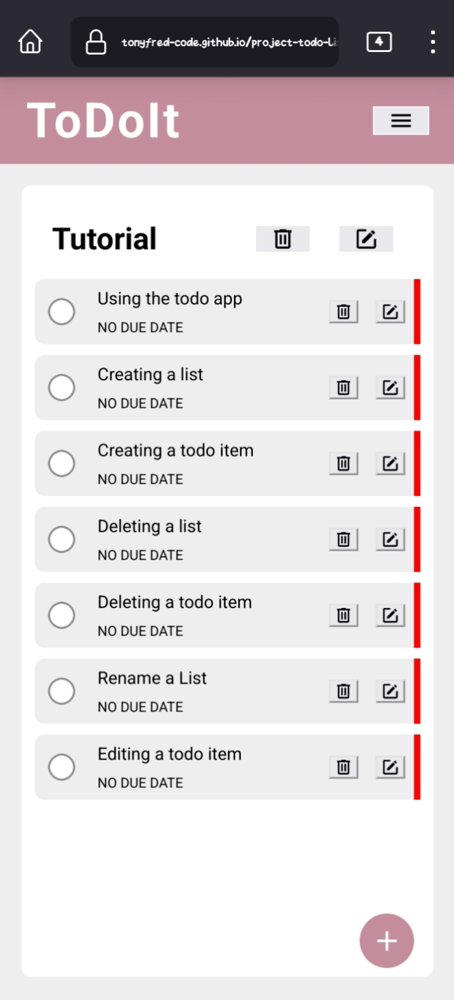

# TODO LIST

TODO LIST is a staple app project where a user can input and edit todo items. This was created as a project in the [JavaScript Path of The Odin Project](https://www.theodinproject.com/lessons/node-path-javascript-todo-list)

## Table of Contents

- [Demo](#demo)
- [Features](#features)
- [Contributing](#contributing)
- [License](#license)
- [Acknowledgments](#acknowledgments)

## Demo

You can check it live at [Todo List Demo](https://tonyfred-code.github.io/project-todo-list/).

## Features

- Creating, editing and deleting list items.
- Creating, editing and deleting todo items.
- Local Storage to keep list and todo items created.

## Contributing

 Contributions are welcome! If you'd like to contribute to this project, please follow these guidelines:

 1. Fork the repository.
 2. Create a new branch for your feature or bug fix.
 3. Make your changes and commit them.
 4. Push your changes to your fork.
 5. Create a pull request.

## License

 This project is licensed under the [MIT LICENSE](./LICENSE)

## Acknowledgments

  From Wikipedia to Stackoverflow to YouTube creators. A big thanks.
